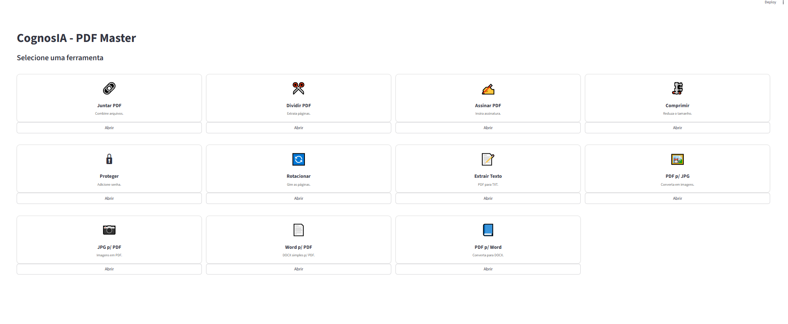

# 👁️ CognosIA - PDF Master


> Uma suíte completa e poderosa de ferramentas para manipulação de PDF, construída com Python e Streamlit.


*(Dica: Renomeie o arquivo 'Screenshot_6.png' para 'preview.png' e coloque na raiz do projeto para a imagem aparecer aqui)*

## 📖 Sobre o Projeto

**CognosIA PDF Master** é uma aplicação web intuitiva que centraliza diversas operações comuns em arquivos PDF. O objetivo é fornecer uma interface amigável (UI) para tarefas que geralmente exigem softwares pagos ou complexos, rodando localmente no seu navegador através do poder do Python.

O projeto utiliza bibliotecas robustas como `PyMuPDF (fitz)`, `ReportLab` e `pdf2docx` para garantir alta performance e fidelidade nas conversões.

## 🚀 Funcionalidades

O sistema conta com um menu visual baseado em "cards" que oferece as seguintes ferramentas:

* **🔗 Juntar PDF:** Combine múltiplos arquivos PDF em um único documento.
* **✂️ Dividir PDF:** Extraia páginas específicas ou intervalos de um arquivo.
* **✍️ Assinar PDF:** Insira uma imagem de assinatura (PNG/JPG) em qualquer posição e página.
* **🗜️ Comprimir:** Reduza o tamanho do arquivo PDF otimizando seus recursos.
* **🔒 Proteger:** Adicione criptografia e senha aos seus documentos.
* **🔄 Rotacionar:** Gire as páginas do PDF (90º, 180º, 270º).
* **📝 Extrair Texto:** Converta o conteúdo do PDF para texto puro (.txt).
* **🖼️ PDF p/ JPG:** Converta páginas de PDF em imagens (download em ZIP).
* **📷 JPG p/ PDF:** Transforme uma lista de imagens em um único arquivo PDF.
* **📄 Word p/ PDF:** Converta documentos simples `.docx` ou `.txt` para PDF.
* **📘 PDF p/ Word:** Converta arquivos PDF de volta para `.docx` editáveis.

## 🛠️ Tecnologias Utilizadas

* [Streamlit](https://streamlit.io/) - Framework para a interface web.
* [PyMuPDF (Fitz)](https://pymupdf.readthedocs.io/) - Motor principal de processamento de PDF.
* [pdf2docx](https://dothinking.github.io/pdf2docx/) - Conversão de PDF para Word.
* [Python-docx](https://python-docx.readthedocs.io/) - Manipulação de arquivos Word.
* [ReportLab](https://www.reportlab.com/) - Geração de PDFs a partir do zero.

## 📦 Instalação e Execução

Siga os passos abaixo para rodar o projeto localmente.

### Pré-requisitos

* Python 3.8 ou superior instalado.

### 1. Clone o repositório

```bash
git clone [https://github.com/seu-usuario/cognosia-pdf-master.git](https://github.com/seu-usuario/cognosia-pdf-master.git)
cd cognosia-pdf-master
